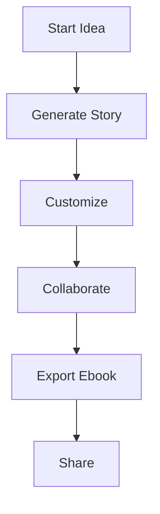

## Overview

Genesis empowers you to create captivating visual stories tailored to any audience. You describe your idea, select a style, and the AI generates professional lessons with stunning visuals. Key capabilities span children's tales, sci-fi epics, brand narratives, ebook exports, and collaboration tools.

<Columns cols={3}>
  <Card title="Story Types" icon="book-open" href="#">
    Generate children's stories, sci-fi adventures, or brand narratives with ease.
  </Card>
  <Card title="Customization" icon="settings" href="#">
    Fine-tune visuals, length, and tone to match your vision.
  </Card>
  <Card title="Export Tools" icon="download" href="#">
    Produce polished ebooks in multiple formats ready for sharing.
  </Card>
</Columns>

## Children's Stories and Educational Lessons

Create engaging stories for kids or interactive lessons for classrooms. You input a theme like `animals in space`, choose a whimsical style, and Genesis builds a narrative with illustrations, morals, and quizzes.

<Steps>
  <Step title="Start a New Story" icon="plus">
    Enter your prompt and select `Children's` genre.

    ```
    Prompt: "A brave fox learns teamwork on a jungle adventure"
    Genre: Children's
    Style: Cartoon
    ```
  </Step>
  <Step title="Add Educational Elements" icon="book-open">
    Include quizzes or facts. Genesis auto-generates age-appropriate content.
  </Step>
  <Step title="Review and Edit" icon="edit">
    Adjust text, swap images, or regenerate sections interactively.
  </Step>
</Steps>

<Callout kind="tip">
  Use simple prompts for best results with young audiences. Aim for `<500` words per story.
</Callout>

## Sci-Fi and Genre-Specific Building

Build immersive worlds in sci-fi, fantasy, or mystery. Genesis handles complex plots, character arcs, and genre tropes automatically.

<Tabs>
  <Tab title="Sci-Fi" icon="zap">
    Generate epic novels with interstellar travel and AI companions.

    ```json
    {
      "genre": "Sci-Fi",
      "plot": "Human explorer discovers ancient alien tech on Mars",
      "length": "novel",
      "visualStyle": "Cyberpunk"
    }
    ```
  </Tab>
  <Tab title="Fantasy" icon="sparkles">
    Craft quests with magic systems and mythical creatures.

    ```json
    {
      "genre": "Fantasy",
      "plot": "Orphan wizard uncovers a hidden realm",
      "length": "novella",
      "visualStyle": "Epic Illustration"
    }
    ```
  </Tab>
</Tabs>

## Brand Story Generation

Craft compelling brand narratives that resonate with your audience. Input your mission, values, and target demographic to produce stories highlighting your products or ethos.

<CodeGroup tabs="Mission,Values">
  ```json
  {
    "type": "brand",
    "mission": "Empowering creators with AI storytelling",
    "audience": "Educators and marketers",
    "tone": "Inspirational"
  }
  ```
  ```json
  {
    "type": "brand",
    "values": ["Innovation", "Accessibility", "Creativity"],
    "product": "Genesis platform",
    "format": "Short story"
  }
  ```
</CodeGroup>

## Ebook Export and Formatting

Export your stories as professional ebooks in EPUB, PDF, or MOBI formats. Customize covers, fonts, and layouts for print or digital distribution.

| Format | Use Case              | Features                  |
|--------|-----------------------|---------------------------|
| EPUB   | E-readers             | Reflowable text, images  |
| PDF    | Print-ready           | Fixed layout, high-res   |
| MOBI   | Kindle devices        | Optimized compression    |

<Callout kind="success">
  Exports include embedded visuals and metadata for seamless publishing.
</Callout>

## Collaboration and Sharing Tools

Work with teams in real-time. Share editable links, add comments, and track versions.

<ExpandableGroup>
  <Expandable title="Invite Collaborators" default-open="true">
    Generate a shareable link with edit or view permissions. Up to 10 users per project.
  </Expandable>
  <Expandable title="Version History">
    Revert changes or branch stories. Automatic saves every 30 seconds.
  </Expandable>
</ExpandableGroup>



These features make Genesis your go-to platform for visual storytelling, from playful lessons to professional ebooks.