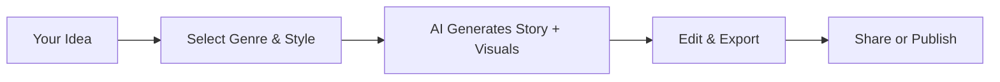

## Platform Overview

Genesis transforms how you create visual learning experiences. You describe your story idea, select a visual style, and the AI generates high-quality, customized lessons or ebooks across genres like children's stories, sci-fi adventures, or brand narratives. The platform's mission is to democratize professional-grade content creation, making it accessible for educators, marketers, and storytellers to produce engaging, illustrated materials without design expertise.

<Callout kind="info">
Genesis supports unlimited generations with your subscription, ensuring you can iterate endlessly on your ideas.
</Callout>

## Key Benefits

You gain speed, customization, and quality in one platform. Here are the core advantages:

<Columns cols={3}>
  <Card title="Instant Generation" icon="zap" href="/docs/generation">
    Create full stories with visuals in seconds from simple prompts.
  </Card>
  <Card title="Style Variety" icon="palette" href="/docs/styles">
    Choose from realistic, cartoon, or abstract visuals to match your audience.
  </Card>
  <Card title="Export Ready" icon="download" href="/docs/export">
    Download as EPUB, PDF, or interactive web books for immediate use.
  </Card>
</Columns>

## Target Audiences and Use Cases

Genesis serves diverse users. Explore tailored examples below.

<Tabs>
  <Tab title="Educators" icon="book-open">
    Build interactive lessons for classrooms. Generate a science fiction story teaching physics concepts with animated diagrams.
    
    <CodeGroup tabs="Prompt Example">
    ```json
    {
      "genre": "sci-fi",
      "theme": "physics principles",
      "audience": "middle school",
      "style": "cartoon"
    }
    ```
    </CodeGroup>
  </Tab>
  <Tab title="Marketers" icon="trending-up">
    Craft brand stories for campaigns. Produce an ebook showcasing your product's journey with custom illustrations.
  </Tab>
  <Tab title="Parents" icon="users">
    Create bedtime stories for children. Personalize tales with family names and favorite themes.
  </Tab>
</Tabs>

## How It Works



This simple flow lets you go from concept to complete ebook effortlessly.

<Expandable title="Advanced Customization Options" default-open="false">
Use parameters like `{length: "short"}` or `{complexity: "advanced"}` in prompts for fine-tuned control. Integrate via API for automated workflows.
</Expandable>

## Get Started in Minutes

Follow these steps to create your first story:

<Steps>
  <Step title="Sign Up" icon="user-plus">
    Create a free account at genesis.ai.
  </Step>
  <Step title="Describe Your Story" icon="edit-3">
    Enter a prompt like "A brave astronaut explores Mars."
  </Step>
  <Step title="Choose Style" icon="image">
    Pick from presets: realistic, watercolor, or pixel art.
  </Step>
  <Step title="Generate & Download" icon="download">
    Click generate, review, and export your ebook.
  </Step>
</Steps>

<Callout kind="tip">
Start with the free tier to test unlimited short stories before upgrading.
</Callout>

Ready to weave your first magical tale? Dive into the [Quickstart Guide](/docs/quickstart).